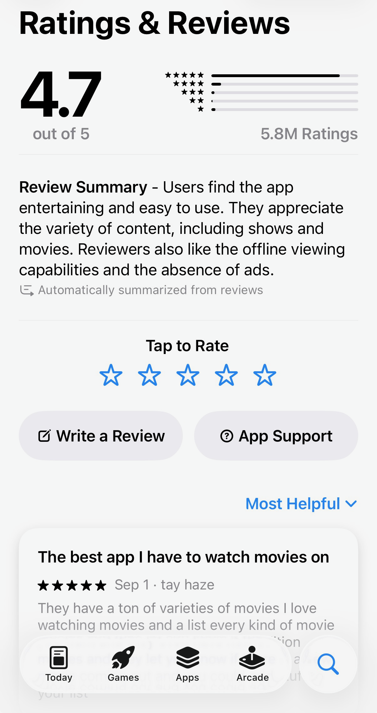
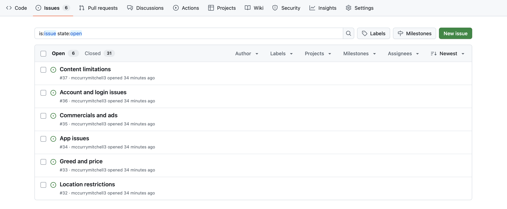
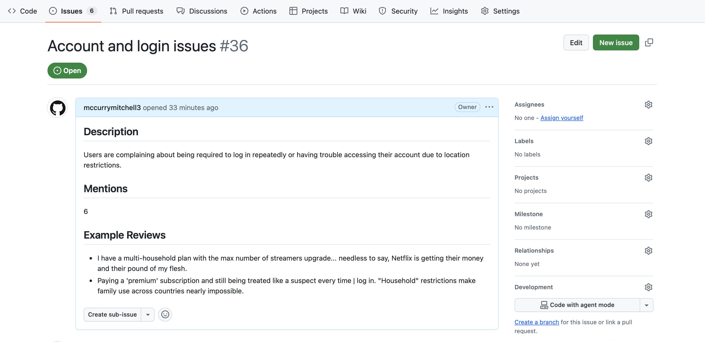

# App Review Agent

This project is a Python-based tool that automatically scrapes App Store reviews for an app, analyzes the top recurring complaints using an LLM (via Ollama), and creates GitHub issues in a repository for those issues.

It is designed as a demonstration of agentic AI: using AI to read, interpret, and take action based on human-written content.

---

## Features

- Scrapes the most recent App Store reviews for a given app ID.
- Uses an LLM to extract top recurring issues, including:
  - Issue title
  - Description
  - Number of mentions
  - Example reviews
- Automatically creates GitHub issues with formatted Markdown.

---

## Tools & Libraries

- Python 3.10+
- [requests](https://pypi.org/project/requests/)
- [PyGithub](https://pypi.org/project/PyGithub/)
- [python-dotenv](https://pypi.org/project/python-dotenv/)
- Ollama LLM (local or API)
- Apple App Store RSS feeds (for review scraping)

---

## Getting Started

1. Clone this repository:

```bash
git clone https://github.com/yourusername/app-review-agent.git
cd app-review-agent
```

2. Create a virtual environment and install dependencies:

```bash
python3 -m venv .venv
source .venv/bin/activate
pip install -r requirements.txt
```

3. Create a `.env` and fill in your credentials:
```dotenv
GITHUB_TOKEN=your_github_token_here
GITHUB_REPO=username/repo
APP_ID=363590051
```

4. Run the script:
```bash
python main.py
```

## Benefits & Value
- Automates feedback collection: Saves developers time by automatically identifying top user complaints.
- Structured insights: Converts unstructured reviews into actionable GitHub issues.
- Free: Completely free to use with Ollama LLM.

## Notes
- Only reviews with a rating ≤ 3 and length > 50 characters are considered.
- Limited to the top 50 most recent reviews.
- Requires a local or network-accessible Ollama LLM.

## Output





